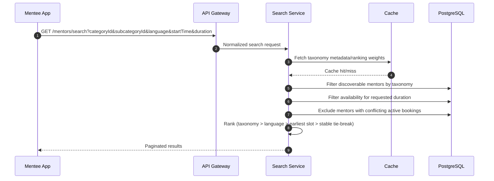
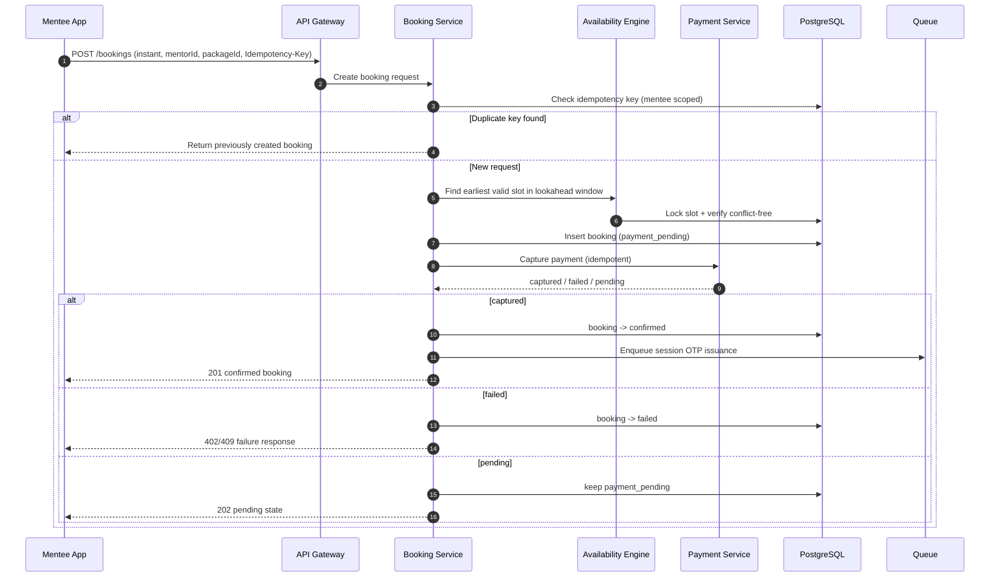
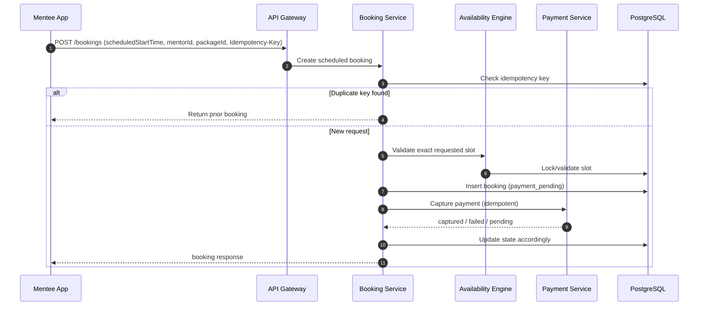
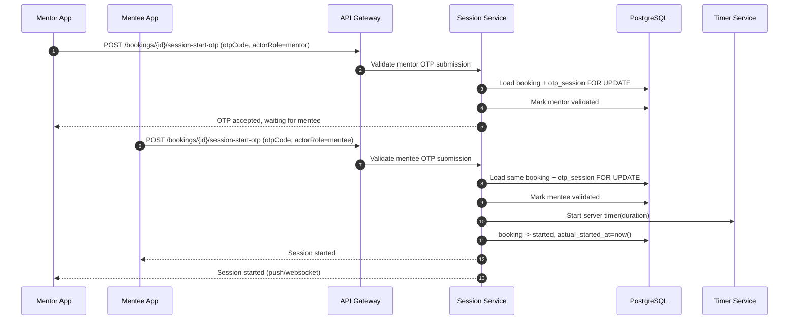
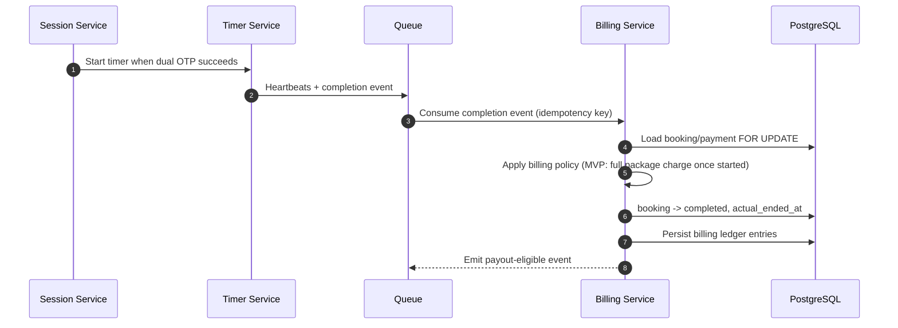
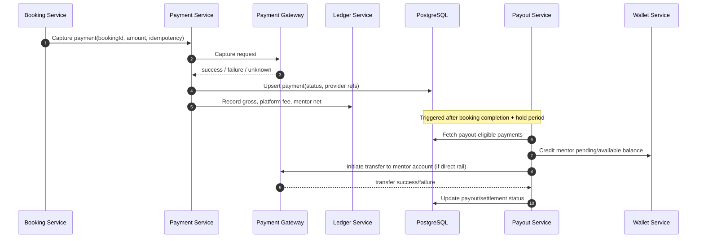

```mermaid
sequenceDiagram
    autonumber
    participant UA as User App
    participant API as API Gateway
    participant AUTH as Auth Service
    participant RL as Rate Limit (Redis)
    participant DB as PostgreSQL
    participant OTP as OTP Provider
    participant TOK as Token Service

    UA->>API: POST /auth/otp/send (phone, countryCode, deviceId)
    API->>AUTH: Validate input
    AUTH->>RL: Check phone/IP/device throttles
    RL-->>AUTH: Allowed / Blocked
    alt Allowed
        AUTH->>DB: Insert otp_session (purpose=login, hash, expires_at)
        AUTH->>OTP: Send OTP
        OTP-->>AUTH: Accepted / Failed
        AUTH-->>UA: otpRequestId, expiresAt, resendAfterSeconds
    else Blocked
        AUTH-->>UA: 429 Too Many Requests
    end

    UA->>API: POST /auth/otp/verify (otpRequestId, otpCode, deviceId)
    API->>AUTH: Verify request
    AUTH->>DB: Select otp_session FOR UPDATE
    AUTH->>AUTH: Validate hash, expiry, attempts
    alt OTP valid
        AUTH->>DB: Mark verified + upsert user
        AUTH->>TOK: Issue JWT(s)
        TOK-->>AUTH: access/refresh tokens
        AUTH-->>UA: 200 tokens + user summary
    else OTP invalid/expired/locked
        AUTH->>DB: Increment attempts / mark expired/locked
        AUTH-->>UA: 4xx error
    end
```

# Mentor Marketplace System Flows

This document defines detailed system flows for:

1. OTP authentication
2. Mentor discovery
3. Booking (instant vs scheduled)
4. OTP session validation
5. Session billing
6. Payment and payout

It includes sequence diagrams (Mermaid text form), failure scenarios, and retry logic for each.

---

## 1) OTP Authentication

### Sequence Diagram

### Failure Scenarios

- OTP send exceeds per-phone/IP/device/day caps -> return `429` with `retry_after`.
- OTP provider send failure or timeout -> attempt provider fallback, else `503`.
- OTP expired before verify -> return `400 OTP_EXPIRED`.
- Exceeded max verify attempts -> OTP session moves to `locked`; reject further attempts.
- OTP replay (already consumed) -> reject with `OTP_ALREADY_USED`.
- Concurrent verify requests -> DB row lock ensures only one success path.

### Retry Logic

- Send OTP: one immediate retry + optional fallback provider.
- Verify OTP: safe to retry; bounded by `max_attempts`.
- Resend OTP: enforce cooldown (for example 30s), invalidate prior active OTP.
- Client timeout retries should reuse same `otpRequestId` for verification.

---

## 2) Mentor Discovery

### Sequence Diagram

### Failure Scenarios

- Invalid taxonomy IDs / invalid duration -> `422 validation_error`.
- Query timeouts due to broad scans -> return partial failure or `503`.
- Cache unavailable -> fall back to DB computation.
- Availability drift (slot taken after search) -> booking flow handles final conflict with `409`.

### Retry Logic

- Read-only search is safe for client retries.
- On cache miss/failure, compute from DB and repopulate cache asynchronously.
- On DB timeout, one short retry with lower page size.
- Use deterministic sorting + cursor/keyset pagination to keep retries stable.

---

## 3) Booking (Instant vs Scheduled)

### 3.1 Instant Booking Sequence

### 3.2 Scheduled Booking Sequence

### Failure Scenarios

- Duplicate create calls due to network retries -> dedupe by idempotency key.
- Slot race between two mentees -> one confirms; other gets `409 SLOT_CONFLICT`.
- Payment success but booking write fails -> reconciliation worker repairs state.
- Gateway timeout with unknown result -> booking remains `payment_pending` pending reconciliation.
- Mentor goes unavailable between search and booking -> final validation fails with `409`.

### Retry Logic

- Booking creation requires `Idempotency-Key`; same key must return same result.
- Payment capture retried with gateway idempotency reference.
- Reconciliation cron resolves uncertain payment states and updates booking.
- Client retry behavior:
  - same key -> safe retry
  - new key -> treated as new booking attempt

---

## 4) OTP Session Validation (Session Start)

### Sequence Diagram

### Failure Scenarios

- Booking not in `confirmed` state -> `409 INVALID_BOOKING_STATE`.
- OTP outside validity window -> `400 OTP_EXPIRED`.
- One side validates, second side never validates within grace -> auto no-show transition.
- Duplicate submission by same actor -> return idempotent success (already validated).
- Too many invalid attempts -> lock OTP and reject.

### Retry Logic

- Validation endpoint idempotent per `(booking_id, actor_role)`.
- Optional one-time OTP re-issue within grace window; old OTP invalidated.
- Timeout worker transitions stale bookings to `mentor_no_show` / `mentee_no_show`.

---

## 5) Session Billing

### Sequence Diagram

### Failure Scenarios

- Duplicate completion events from retries/reconnects -> dedupe by idempotency key.
- Session disconnects mid-call -> timer remains server-authoritative.
- Early end by mentee -> no billing change in MVP (full package).
- Early end by mentor -> flag for refund workflow.
- Billing consumer crash after DB write before ack -> safe reprocess due to idempotency.

### Retry Logic

- Queue consumer: at-least-once processing + idempotent DB mutations.
- Transient DB/gateway errors: exponential backoff retry.
- Poison messages: dead-letter queue + operator alert.

---

## 6) Payment and Payout

### Sequence Diagram

### Failure Scenarios

- Capture request timeout with unknown status -> reconciliation required via provider reference.
- Duplicate capture/refund attempt -> blocked via idempotency + unique provider refs.
- Refund after payout completed -> create negative adjustment in next payout cycle.
- Transfer failure -> keep funds pending and retry; notify mentor if prolonged.
- Ledger mismatch (rare) -> freeze payout for affected booking, raise ops alert.

### Retry Logic

- Payment capture: bounded retries with same idempotency key.
- Reconciliation worker polls uncertain transactions until terminal status.
- Payout transfer retries with exponential backoff and max-attempt threshold.
- Wallet balance updates use optimistic locking/version checks to avoid race conditions.

---

## Cross-Cutting Reliability and Consistency Rules

- Use UTC (`timestamptz`) as canonical time source across all services.
- Every mutating API should be idempotent (`Idempotency-Key` or natural key).
- Use transactional locks (`SELECT ... FOR UPDATE`) for critical state transitions:
  - OTP verify/consume
  - booking state updates
  - payment finalization
- Keep append-only financial/event logs for reconciliation and audits.
- Run background jobs for:
  - payment-booking reconciliation
  - OTP/session timeout transitions
  - payout retry and settlement reconciliation

